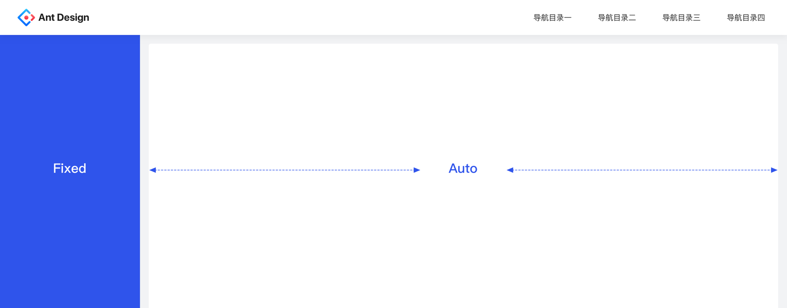
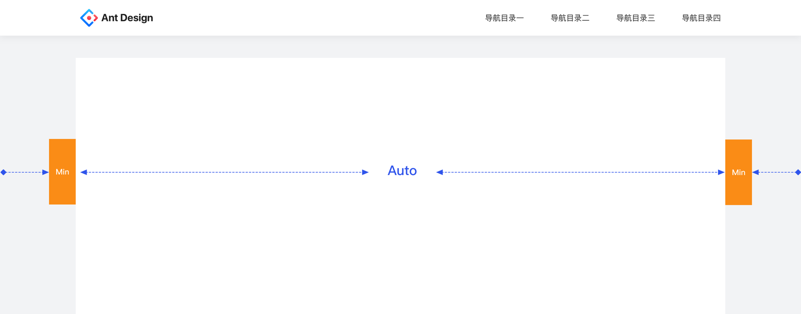
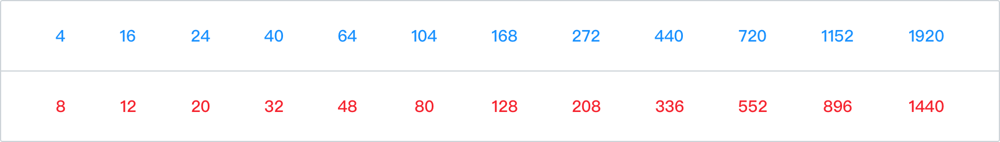
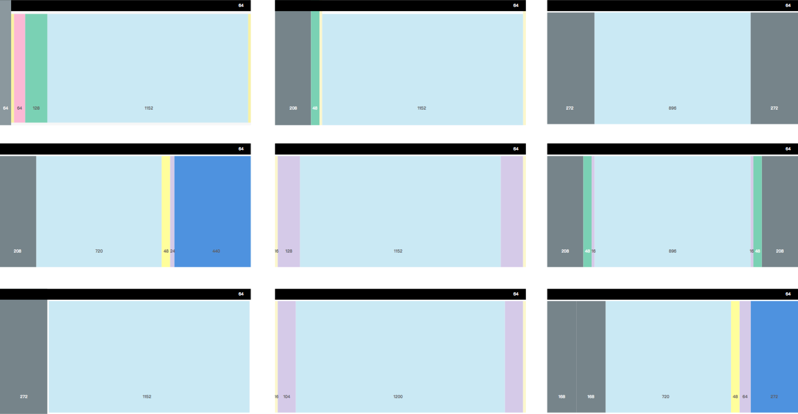

# Layout 布局
 
## 画板尺寸

为了尽可能减少沟通与理解的成本，有必要在组织内部统一设计板的尺寸。项目统一的画板尺寸为 1440。

## 适配

### 一、左右布局的适配方案

常被用于左右布局的设计方案中，常见的做法是将左边的导航栏固定，对右边的工作区域进行动态缩放。

### 二、上下布局的适配方案

常被用于上下布局的设计方案中，做法是对两边留白区域进行最小值的定义，当留白区域到达限定值之后再对中间的主内容区域进行动态缩放。

这里提及的只是非常简单的两种适配的思路，实际设计中一套完美的适配方案需要设计师具备前端视角、平面构图视角以及交互视角。

### 常用模度

间距和宽高等都应该基于8px的倍数，以保证视觉上的一致性。

